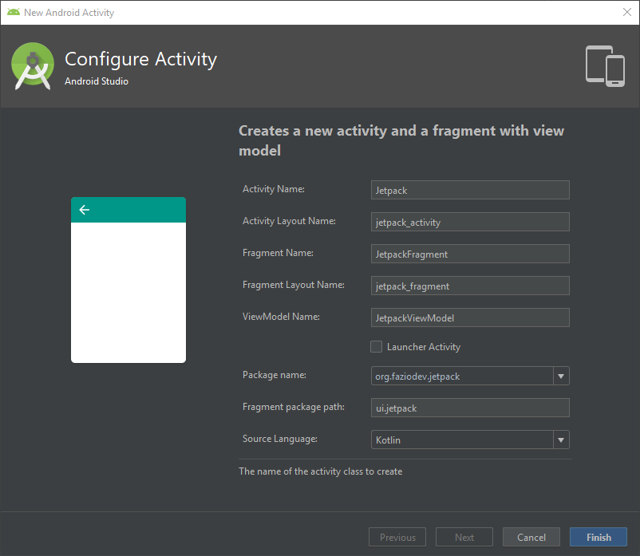
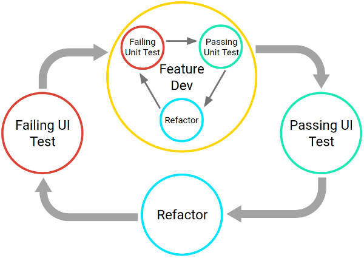
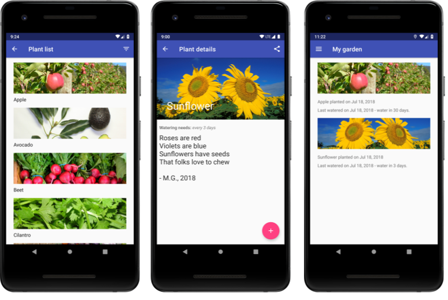

# Android Jetpack
### Make Better Apps

_tl;dr - Make better apps faster with Android Jetpack._

I could explain Android Jetpack at a high level, but I'll let the Google marketing team take care of it:
"Jetpack is a collection of Android software components to make it easier for you to develop great Android apps. These components help you follow best practices, free you from writing boilerplate code, and simplify complex tasks, so you can focus on the code you care about."

Sounds great, right?  But what exactly are these components?  They're collections of libraries, separate from the platform APIs, which we can bring into our apps as we wish.  Each component can be added separately as needed without worry about which version of Android our users are on.

We'll cover all four types of components (Foundation, Architecture, Behavior, and UI) and focus on key pieces like ViewModels and Room.


## Jetpack Overview
+ Combo of components and best practices for making great Android apps
+ Remove boilerplate code
+ Simplify complex tasks
+ New components live in `androidx.` package
  + Separate components; only bring in what you need
  + Separately versioned

## Kotlin
+ Use it!
+ First-class language on Android
+ Concise
+ Safe
+ Easy to add to existing Android projects
+ Android Studio can convert Java to Kotlin for you
+ Check out https://www.kotlinlang.org for more info
    + Try out https://play.kotlinlang.org

## Adding Jetpack to your Project
+ Android Studio: _New > Activity > Fragment + ViewModel`



## Foundation
Foundation components provide cross-cutting functionality like backwards compatibility, testing and Kotlin language support.
### `AppCompat`
+ Need to handle old OS versions
+ `AppCompat` allows you to use newer features on old devices
+ `AppCompat` can now be found in the `androidx.`package
    + Existing versions _do_ still work
    + All new development is in `androix.` version
    + Migration
        + Inside Android Studio: _Refactor > Migrate_
        + `android.useAndroidX=true`
        + `android.enableJetifier=true`
        + https://developer.android.com/jetpack/androidx/migrate
+ Target API level 28 (Android 9)

### `Android KTX`
+ Kotlin Extensions
+ Remove boilerplate code
+ Requires `google()` repository and `androidx.*:*-ktx` dependencies
+ https://developer.android.com/kotlin/ktx

### Multidex
+ Used for apps with more than 64K method calls
    + Between app and libraries
```gradle
android {
    defaultConfig {
        ...
        minSdkVersion 21 
        targetSdkVersion 28
        multiDexEnabled true
    }
    ...
}

// Required if your minSdkVersion is 20 or lower
dependencies {
  compile 'com.android.support:multidex:1.0.3'
}
```

### Testing


https://developer.android.com/training/testing/

## Architecture
Architecture components help you design robust, testable and maintainable apps.

### Lifecycles
+ Components go through lifecycle changes based on OS interaction
+ Lifecycle-aware components respond to lifecycle status changes
+ Use the `android.arch.lifecycle` package
    + Lifecycle: Contains `Event` and `State`
    + LifecycleOwner: Contains `getLifecycle()`
    + LifecycleObserver: Supports `@OnLifecycleEvent(...)` annotation
+ Can handle manually, but usually rely on lifecycle-aware components
    + `ViewModel`
    + `LiveData`

### `ViewModel`
+ Sources data to views
+ Lifecycle-aware; saves data through `Activity`/`Fragment` lifecycles
    + `Activity` will always get the same `ViewModel` instance
+ Keep data logic out of UI layer
    + Easier to understand
    + Easier to test
+ `ViewModel` should never reference a view, lifecycle, or any class with an `Activity` context reference


```kotlin
class MyViewModel : ViewModel() {
    private lateinit var users: MutableLiveData<List<User>>

    fun getUsers(): LiveData<List<User>> {
        if (!::users.isInitialized) {
            users = MutableLiveData()
            loadUsers()
        }
        return users
    }

    private fun loadUsers() {
        // Do an asynchronous operation to fetch users.
    }
}
```

### `LiveData`
+ Lifecycle-aware observable
+ Attach observers to `LiveData`
    + Can also bind within XML
+ Live in `ViewModel`, not UI components
+ Advantages
    + Only updates components when active
    + No more manual lifecycle handling
    + Ensures your UI matches your data state
    + No memory leaks
    + No crashes due to stopped activities
    + Always up-to-date data
    + Proper configuration changes
    + Sharing resources
+ Can use `Transformations` to map data before sending to observers

### Data Binding
Bind UI components to data in XML
```xml
<TextView
    android:id="@+id/week_header_text"
    android:layout_height="wrap_content"
    android:layout_width="0dp"
    android:text="@{currentWeekViewModel.currentWeekHeader}"
    ...
/>
```

Enable data binding in your app's `build.gradle` file
```gradle
android {
    ...
    dataBinding {
        enabled = true
    }
}
```

+ Add a `<data>` section with one or more `<variable>` tags
+ Can bind text, `onClick` or other methods, checkboxes, etc.
+ Two-way binding is available:
    + `android:checked="@={viewModel.enteredIntoSystem}"`

### Room
Abstraction layer over SQLite


https://developer.android.com/training/data-storage/room/

+ `@Entity`: Data class that maps to a DB table
+ `@Dao`: Interface with methods for accessing Entities
+ `@Database`: Abstract class that references the SQLite DB
+ Migrations are available
+ `@DatabaseView` is available for selected queries

### Paging
Load data gradually and gracefully into a `RecyclerView`
+ Use less data/network bandwidth
+ Quickly respond to user input
+ `PagedList`: Loads data from a `DataSource`
+ `PagedListAdapter`: Takes a `PagedList` and feeds the data to a `RecyclerView`
+ Can get data from DB (Room), server (Retrofit), or both
+ Room overview video: https://l.faziodev.org/paging-youtube

### WorkManager
Run deferrable, async tasks
+ Library determines best way to run task
+ `Worker` has a method called `doWork()`
    + Built via `OneTimeWorkRequestBuilder` or `PeriodicWorkRequestBuilder`
+ `WorkManager` enqueues `Worker` instances
+ `WorkInfo` get info and events about current work status

### Navigation
Navigation Architecture Component handles moving between destinations
+ Destinations include `Activity`, `Fragment`, navigation (sub)graphs, and custom destination types
+ Destinations are connected via Actions
+ Destinations + Actions == Navigation Graph
+ Benefits
    + Handle fragment transactions
    + Handle Up/Back actions correctly by default
    + Providing standardized resources for animations and transactions
    + Treating deep linking as a first-class operation
    + Use nav drawers and bottom navs with minimal work
    + Type safety when passing info during navigation
    + Visual navigation in Android Studio
+ Principles of Navigation
    + Fixed start destination
    + Nav state should be a stack of destinations
    + Up button never exits the app
    + Up and back are identical in your app
    + Deep linking and navigating to a destination should have the same stack
+ Navigation graph is an XML file with all your destinations and actions
+ Can use `setupWithNavController` with bottom nav or navigation drawers
    + Match menu item IDs with destination IDs and navigation will work automatically
+ Visual navigation editor in Android Studio
    + Enable with _Settings > Experimental > Enable Navigation Editor_

## Behavior
Behavior components help your app integrate with standard Android services like notifications, permissions, sharing and the Assistant.

### Behavior Components
+ Download Manager
    + Schedule and manage large downloads
+ Media & Playback
    + Backwards-compatible APIs for media playback and routing (including Google Cast)
    + Shows best practices
        + Client/server set up for audio, single-activity design for videos
+ Notifications
    + Backwards-compatible API with support for Wear and Auto
    + More best practices!
+ Permissions
    + Compatibility APIs for checking/requesting app permissions
    + Implementation info
    + Even more best practices
+ Preferences
    + Create an instance of `PreferenceFragment`
    + Create a `PreferenceScreen` in XML to be loaded by your `fragment`
+ Sharing
    + Use `ShareActionProvider`
    + Set up share `Intent`
+ Slices
    + Show content from your app in Google Search and the Google Assistant
    + Use templates to set up/style the UI
    + Supports deep linking, LiveData, scrolling content, inline actions
    + Backwards compatible through KitKat (API level 19)
    + Not available to users currently, but ready for development

## UI
UI components provide widgets and helpers to make your app not only easy, but delightful to use.

### UI Components

#### Core Concepts
+ Animation & Transitions
+ Fragments
+ Layout

#### Form Factors
+ Android Auto
+ Android TV
+ Wear OS by Google

### Emoji
+ `EmojiCompat` support library can display emoji even when the user's device doesn't have them
+ `CharSequence` -> `EmojiSpan`

### Palette
+ Extracts colors from images
+ `Palette.from(bitmap).generate()`


## Android Sunflower

Gardening app to show how to use Jetpack



https://github.com/googlesamples/android-sunflower

## Useful Links
+ Jetpack Home: https://g.co/jetpack
+ Getting Started with Jetpack: https://goo.gl/bGnL7N
+ Introducing Android Jetpack: https://youtu.be/LmkKFCfmnhQ
+ Jetpack on YouTube: https://l.faziodev.org/jetpack-youtube
+ Paging on YouTube: https://l.faziodev.org/paging-youtube
+ Android Sunflower: https://l.faziodev.org/jetpack
+ Room with a View: https://l.faziodev.org/android-rwav-kotlin